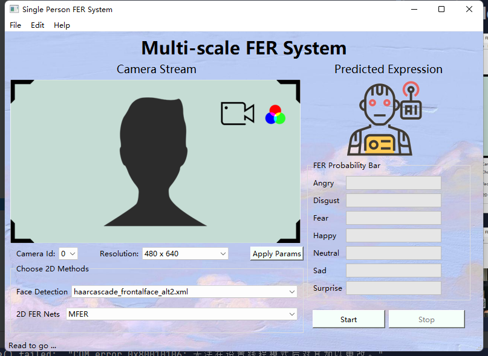
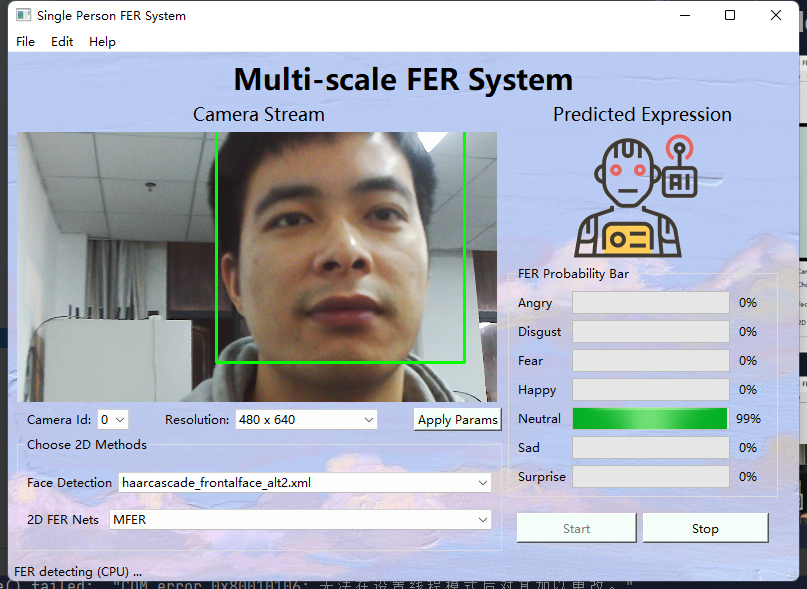

# EmotionUI
 Software for Multi-scale 2D Facial Expression Recognition (FER) UI.

## Demo screenshot

(with RealSense)

## Required packages
 - Python >= 3.6
 - numpy >= 1.19.5
 - Opencv-python >= 4.5
 - PySide6 >= 6.2.1
 - PyTorch >= 1.10
 - TorchVision >= 0.11

## Hardware
 1) usb camera
 2) NV GPU (optional, CPU version also works)
## More
please see the [MFER](https://github.com/XuJ1E/MFER) project.
